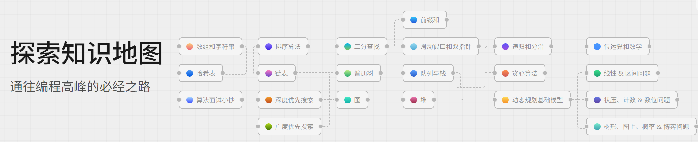

# Leetcode
Python Solutions for Leetcode.

**附上Leetcode官方学习路线：**

## 数组与字符串
### 数组
| 题目原址 | 难易程度 | 题解 | 解题思路 |
| :----: | :----: | :----: | :----- |
| [1991.寻找数组的中心索引](https://leetcode-cn.com/problems/find-the-middle-index-in-array/) | 简单 | [✅](00_数组与字符串/find-the-middle-index-in-array.py) | left_sum + mid_value + right_sum = total, 即2*left_sum + mid_value = total, 找出第一个满足该式的值即可 |
| [35.搜索插入位置](https://leetcode.cn/problems/search-insert-position/) | 简单 | [✅](00_数组与字符串/search-insert-position.py) | 二分查找，不断逼近大于等于target的值，最终的左指针位置即为插入位置或匹配位置 |
| [56.合并区间](https://leetcode.cn/problems/merge-intervals/)| 中等 | [✅](00_数组与字符串/merge-intervals.py) | 按照区间左值大小排序，遍历时比较上一个区间右值与当前区间左值的大小，看是否能合并 |

### 二维数组（矩阵）
| 题目原址 | 难易程度 | 题解 | 解题思路 |
| :----: | :----: | :----: | :----- |
| [48.旋转矩阵](https://leetcode-cn.com/problems/rotate-image/) | 中等 | [✅](00_数组与字符串/rotate-image.py) | 原地顺时针旋转九十度等价于：先沿主对角线（左上到右下）转置矩阵，再逐行翻转矩阵 |
| [73.矩阵置零](https://leetcode.cn/problems/set-matrix-zeroes/) | 中等 | [✅](00_数组与字符串/set-matrix-zeroes.py) | 为实现原地操作，用第一行和第一列标记需要置零的行列，提前记录第一行第一列是否有0，最后再处理第一行第一列 |
| [498.对角线遍历](https://leetcode.cn/problems/diagonal-traverse/) | 中等 | [✅](00_数组与字符串/diagonal-traverse.py) | 解析太长，放在题解里的注释了 |

### 字符串
| 题目原址 | 难易程度 | 题解 | 解题思路 |
| :----: | :----: | :----: | :----- |
| [14.最长公共前缀](https://leetcode.cn/problems/longest-common-prefix/) | 简单 | [✅](00_数组与字符串/longest-common-prefix.py) | 把第一个字符串作为初始prefix, 依次和后面的每个字符串去比对，前缀不同就缩短prefix，直到都能匹配为止。如果某次比对后prefix变成空字符串，直接返回"" |
| [5.最长回文子串](https://leetcode.cn/problems/longest-palindromic-substring/) | 中等 | [❓](00_数组与字符串/longest-common-prefix.py) |  |
| [151.反转字符串中的单词](https://leetcode.cn/problems/reverse-words-in-a-string/) | 中等 | [✅](00_数组与字符串/reverse-words-in-a-string.py) | python字符串是不可变类型，所以无法实现进阶原地解法，这题算简单题。先去除空格得到单词列表，反转之后拼接空格即可 |
| [28.找出字符串中第一个匹配项的下标](https://leetcode.cn/problems/find-the-index-of-the-first-occurrence-in-a-string/) | 简单 | [✅](00_数组与字符串/find-the-index-of-the-first-occurrence-in-a-string.py) | 看完链接里[关于KMP算法的概念](https://leetcode.cn/problems/find-the-index-of-the-first-occurrence-in-a-string/solutions/732461/dai-ma-sui-xiang-lu-kmpsuan-fa-xiang-jie-mfbs)之后，看本题题解，注释清晰 |

### 双指针技巧
| 题目原址 | 难易程度 | 题解 | 解题思路 |
| :----: | :----: | :----: | :----- |
| [344.反转字符串](https://leetcode.cn/problems/reverse-string/description/) | 简单 | [✅](00_数组与字符串/reverse-string.py) | 左右指针往中间逼近，左右交换字符即可 |

